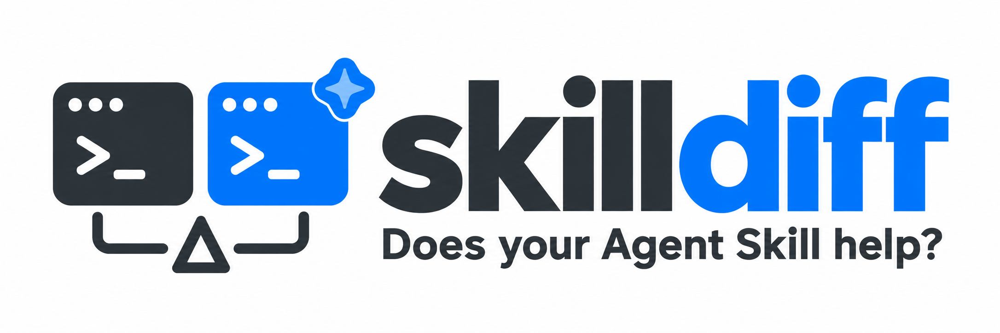
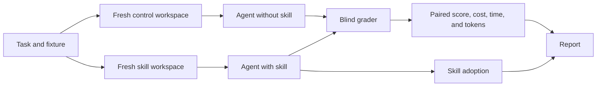

# SkillDiff



**Does your Agent Skill help?** skilldiff runs the same tasks with and without your
skill in fresh, identical workspaces. It grades both runs and reports the difference
in score, cost, time, and tokens. It also reports whether the agent used the skill.

It works with [Claude Code](https://code.claude.com/docs/en/overview),
[Codex](https://github.com/openai/codex), [OpenCode](https://opencode.ai), and
[Antigravity](https://antigravity.google). It can evaluate one skill or all skills in a
package. It can also evaluate a PR. The head commit is the treatment. The merge base
is the control.

## Quick start

Requirements: Python 3.10+, Git, and a signed-in agent CLI.

```bash
uv tool install git+https://github.com/karangattu/skilldiff   # or: pipx install git+https://github.com/karangattu/skilldiff
skilldiff init          # a runnable demo experiment
skilldiff check         # validate the setup without running any agents
skilldiff run --runs 1  # one control/skill pair per task
```

> [!IMPORTANT]
> Install from GitHub as shown above. The `skilldiff` package on PyPI is an unrelated project.

To test your own skill:

```bash
skilldiff init --skill ~/code/my-package/.claude/skills/my-skill --dir my-skill-eval
cd my-skill-eval   # fill in tasks/ and graders/, then:
skilldiff check && skilldiff run
```

Each run writes `report.html` (self-contained), `report.md` (renders on GitHub, so you
can paste it into a PR), `report.qmd` (for Quarto), and `results.json`. It also saves the
transcript and diff for every session.

## Example result

This table shows the summary in `report.md`. The numbers are illustrative. They are
not results from a skilldiff experiment.

| Metric | Control | Skill | Difference | 95% CI |
|:---|---:|---:|---:|---:|
| Task score | 60% | 80% | +20 pp | +5 to +35 pp |
| Success | 3/5 | 4/5 | +1 | |
| Median cost | $0.30 | $0.24 | -$0.06 | -$0.10 to -$0.02 |
| Median time | 90s | 75s | -15s | -25s to -5s |
| Median tokens | 20k | 18k | -2.0k | -3.0k to -1.0k |
| Skill used | unknown | 5/5 | | |

In a skill report, the difference is **skill minus control**. A higher task score is
better. Lower cost, time, and token counts are better. The 95% CI estimates the
uncertainty in the mean paired difference. If it includes zero, the result does not
show a clear effect.

The report starts with a verdict for the mean paired score change and any warnings.
After the summary, it shows key takeaways and results by model and task. It also links
to each run's transcript and diff.
For Claude, cost is the API-equivalent price, even with a subscription. Token counts
include cached input.

<details>
<summary>Tips for meaningful results</summary>

- Use **5 or more runs**. One or two runs cannot separate an effect from noise.
- Write tasks that use what the skill uniquely provides, such as obscure APIs, recent
  changes, or house conventions. If control scores 100%, the report calls it a ceiling effect.
- Do not name the skill in prompts. Skill adoption is part of the measurement.
  Low adoption can mean that the skill's `description` needs work.
- Read warnings about agent errors, timeouts, control access to the skill, skill
  runs that ignored the skill, and tasks without graders.

</details>

## Use it from your agent

skilldiff ships as an agent skill. You can ask your coding agent to test a skill: it
designs fair tasks, writes graders, runs the experiment, and explains the result. The
agent installs the `skilldiff` CLI itself if it's missing.

### 1. Install the skill

| Agent | Install | Invoke |
|---|---|---|
| Claude Code | `/plugin marketplace add karangattu/skilldiff`, then `/plugin install skilldiff@skilldiff` | `/skilldiff:skilldiff <path>` |
| Codex | Copy to `~/.agents/skills/skilldiff` (all repos) or `.agents/skills/skilldiff` (one repo) | `$skilldiff <path>`, or pick it from `/skills` |
| OpenCode | Copy to `~/.config/opencode/skills/skilldiff` (it also reads `~/.agents/skills` and `~/.claude/skills`) | Ask for it by name |
| Gemini CLI | Copy to `~/.gemini/skills/skilldiff` or `~/.agents/skills/skilldiff` | Ask for it by name. Check with `/skills list` |

To copy the skill once for every agent that reads `~/.agents/skills`:

```bash
git clone --depth 1 https://github.com/karangattu/skilldiff /tmp/skilldiff
mkdir -p ~/.agents/skills && cp -R /tmp/skilldiff/skills/skilldiff ~/.agents/skills/
```

For Claude Code without the plugin, copy the folder to `~/.claude/skills/skilldiff`
instead and invoke it with `/skilldiff <path>`. You can also run
`npx skills add karangattu/skilldiff` to install it for several agents.

### 2. Ask for an evaluation

Invoke the skill with the path to the skill you want to test, then add instructions in
plain language:

```text
/skilldiff:skilldiff ~/code/py-shiny/.claude/skills/shiny-docs
Test whether this skill helps sonnet and opus write current Shiny APIs.
```

```text
$skilldiff ./skills
Evaluate every skill this package ships, using the codex harness.
```

Prompts without a slash command work too:

- *"Use skilldiff to check whether my `changelog-style` skill changes anything."*
- *"Run the skilldiff experiment in `./shiny-eval` again with 5 runs and summarize the report."*
- *"Read the latest skilldiff results and tell me whether the skill is worth its token cost."*

The agent you talk to and the harness you test can differ. For example, you can ask
Claude Code to set up an experiment that runs Codex sessions.

### 3. What the agent does

1. Reads the skill to learn what it claims to improve.
2. Runs `skilldiff init --skill <path>` in a separate folder, outside the skill's own
   repository.
3. Writes 2–5 tasks, small fixtures, and graders that accept every valid solution.
4. Runs `skilldiff check` until it's clean, then a smoke test with `--runs 1`.
5. **Asks you before the full run**, and shows the session count and maximum spend.
6. Summarizes the report: the verdict with its confidence interval, skill adoption,
   efficiency, and warnings.

### Requirements when an agent runs skilldiff

<details>
<summary>Shell, login, network, and time requirements</summary>

- **Shell access.** The agent must be allowed to run `skilldiff`. In Claude Code you can
  allow it with the permission rule `Bash(skilldiff *)`.
- **A signed-in agent CLI.** skilldiff starts separate `claude -p`, `codex exec`, and
  similar sessions, which use your normal login. Sign in once in a terminal, for
  example with `claude auth login`. When skilldiff runs inside Claude Code, it removes
  the parent session's environment variables, so each run is independent.
- **Network access.** If the agent's sandbox blocks network access or starting other
  CLIs, the sessions fail and the report lists them as errors. In that case the agent
  gives you the `skilldiff run` command to run in your own terminal, and reads the
  results afterwards.
- **Time.** A full run can take longer than the agent's shell timeout, so the agent
  runs it in the background and checks progress with `skilldiff results`.

</details>

## How it keeps the comparison fair



Skilldiff runs each pair in random order and grades anonymized results. The diagram
shows a skill evaluation. In a PR evaluation, the control uses the merge base and
the treatment uses the head commit.

<details>
<summary>How isolation, grading, and statistics work</summary>

- **Identical workspaces.** Each pair gets two fresh copies of the task's fixture.
  Only the skill arm has the skill installed, at the path the harness expects. If a
  fixture already contains the skill, skilldiff removes it from the control copy.
- **Isolation.** For Claude, `claude.isolate: true` (the default) passes
  `--setting-sources project,local`. This stops user-level skills, plugins, and
  `~/.claude/CLAUDE.md` from leaking into either arm. For the other harnesses,
  `skilldiff check` warns you if the skill is also installed at user level.
- **Random order.** The arm that runs first is chosen at random for each pair, so warm
  caches and rate limits don't favor one side.
- **Blind grading.** Graders see anonymized candidates. The skill name, model name, and
  arm are redacted from responses and diffs.
- **Adoption tracking.** The report shows how many skill runs actually used the skill.
  For Claude this comes from `Skill` tool calls and reads of the skill's files. For the
  other harnesses it comes from references to the skill's files in the transcript.
- **Honest statistics.** Differences are paired by model, task, and repetition. Each
  difference gets a bootstrap 95% confidence interval. If the interval includes zero,
  the verdict says there is no clear effect.
- **Robust runs.** Every agent session has a timeout. Background processes are
  cleaned up, and stdin is closed. Failed sessions (auth errors, turn or budget limits)
  are flagged, not silently graded as normal runs. Press Ctrl-C to stop and still get a
  report for the completed pairs.

</details>

## Configure an experiment

`skilldiff.yaml`:

```yaml
name: my-skill-eval
skill: ../my-package/.claude/skills   # one skill dir (has SKILL.md) or a folder of skills
harness: claude                       # claude | codex | opencode | antigravity
models:
  - sonnet
  - opus
tasks:
  - ./tasks/*.yaml
runs: 5                               # repetitions per arm and task
timeout_seconds: 1800                 # per agent session
parallel: 1                           # pairs to run concurrently

claude:
  auth: subscription                  # or api_key (uses ANTHROPIC_API_KEY)
  effort: high
  max_turns: 30
  max_budget_usd: 2.00                # per session
  permission_mode: acceptEdits
  isolate: true
  allowed_tools:
    - Bash(my-cli *)                  # commands your skill needs
```

A task (`tasks/fix-parser.yaml`):

```yaml
id: fix-parser
repo: ../fixtures/parser     # copied into each workspace; relative to this file
prompt: |
  Fix the parser so that it accepts empty input. Keep all existing tests passing.
grader:
  type: command
  command: python3 "$SKILLDIFF_TASK_DIR/../graders/fix_parser.py"
```

### Graders

<details>
<summary>Grader output, environment variables, and checks</summary>

A grader is a shell command that runs inside the workspace after the agent finishes:

- Exit code 0 passes and any other exit code fails. For partial credit, print JSON with
  a `score` from 0 to 1, for example `{"score": 0.8, "success": false, "checks": [true,
  false]}`. The JSON can be the only output or the last line of the output. The report
  shows `checks` as *Checks passed*.
- The grader receives these environment variables: `SKILLDIFF_RESPONSE_FILE` (the
  agent's final message), `SKILLDIFF_DIFF_FILE` (a git diff of its changes),
  `SKILLDIFF_TASK_DIR` (the folder of the task file), and `SKILLDIFF_CANDIDATE_DIR`.
- Keep graders outside the fixture so the agent can't read or change them. Accept every
  valid solution, not only the one your skill recommends.
- `skilldiff check` runs each grader on the untouched fixture. If the fixture already
  scores 100%, the task can't show a difference.

</details>

### Testing a package's skills

If a package ships several skills, for example `my-package/.claude/skills/{a,b,c}`, point
`skill:` at the parent folder. The skill arm installs all of them, and adoption counts a
run as using the skill if it uses any of them.

## Evaluate a PR's feature

Run the same agent tasks against the code with and without a PR:

```bash
# Fetch the PR into an existing local clone (GitHub PR #42 in this example).
git -C ~/code/my-package fetch origin refs/pull/42/head:refs/pull/42/head

skilldiff init --pr 42 --repo ~/code/my-package --base origin/main --dir pr-42-eval
cd pr-42-eval
# Fill in tasks/my-first-task.yaml and graders/my_first_task.py, then:
skilldiff check
skilldiff run --runs 1
```

`--pr` scaffolds the experiment; it does not fetch from GitHub. Fetch the target branch
as needed too. For a local branch or another Git host, configure the refs directly:

```yaml
name: feature-eval
pr:
  repo: ../my-package        # local Git clone, relative to this config
  base: origin/main         # PR target ref
  head: refs/pull/42/head    # or a feature branch / commit SHA
harness: claude
models: [sonnet]
tasks: [./tasks/*.yaml]
runs: 5
```

Use exactly one of `skill` or `pr`. Tasks keep the same prompt and grader format,
but omit `repo`: both arms use `pr.repo`. Keep graders and experiment files outside
the evaluated repository. Design tasks that **use** the new feature, and grade the
resulting behavior. If setup or installation is needed, include identical instructions
in the task so each agent uses the package in its own workspace.

- **Control:** the common ancestor (merge base) of `base` and `head`.
- **Treatment:** the PR's `head` commit, including all its changes.
- Refs are resolved once per run. Reports and JSON record the exact commit IDs.
- Each workspace contains the committed files and a fresh Git history. Uncommitted
  files and the source repository's history are excluded; your checkout is unchanged.
- Both arms use the same harness, model, prompt, and grader. Skill installation/removal
  and adoption tracking are disabled in PR mode; skills committed in the repo remain
  part of their respective revisions.
- HTML, Markdown, Quarto, and terminal reports label the arms **Control** and
  **Treatment**, with differences expressed as treatment minus control. For compatibility,
  aggregate JSON metrics still use the existing `skill` key for the treatment metrics;
  individual sessions use `runs.treatment` and include `source_commit`.

<details>
<summary>PR evaluation limits and setup notes</summary>

This measures the full PR relative to its branch point, not the effect of reverting it
on today's main branch. For an already-merged PR, select a `base` commit from before
its merge; using a base that already contains the head is rejected. Fetch enough history
for Git to find a common ancestor. Submodules are currently unsupported. The evaluator
still runs agent sessions and then grades their outputs, so use tasks and external
graders that measure your intended outcome.

</details>

## Commands

| Command | What it does |
|---|---|
| `skilldiff init [--skill PATH] [--harness H] [--dir D]` | Scaffold a runnable demo, or a template for your skill |
| `skilldiff init --pr N --repo PATH [--base REF] [--dir D]` | Scaffold a PR feature evaluation using locally fetched refs |
| `skilldiff check [-c CONFIG]` | Validate the config, the CLI, the skill frontmatter, and the graders. Estimate the session count and maximum spend |
| `skilldiff run [-c CONFIG] [--runs N] [-j N] [-m MODEL] [-t TASK]` | Run the experiment, or a subset of it |
| `skilldiff results [RUN_DIR] [--json \| --markdown]` | Show the latest run, or export it |
| `skilldiff report [RUN_DIR]` | Rebuild the reports for a run, including runs from older versions |

## Harness notes

<details>
<summary>Claude Code, Codex, OpenCode, and Antigravity settings</summary>

**Claude Code.** Subscription auth is the default. skilldiff removes
`ANTHROPIC_API_KEY` and `ANTHROPIC_AUTH_TOKEN` from each session, so an exported key
can't silently switch billing. Sign in once:

```bash
env -u ANTHROPIC_API_KEY -u ANTHROPIC_AUTH_TOKEN claude auth login
```

To bill through the API, set `auth: api_key` and export `ANTHROPIC_API_KEY`.
`acceptEdits` lets unattended sessions edit the disposable workspaces. Allow-list the
commands your skill runs with `allowed_tools`. Avoid `bypassPermissions` unless you
trust every task and fixture. Set `isolate: false` to test against your everyday setup,
with your user-level skills and plugins loaded.

**Codex.** `codex: {auth: stored, sandbox: workspace-write}`. `stored` removes
`OPENAI_API_KEY` so your ChatGPT login is used.

**OpenCode.** `service: go` (the default) routes models to the `opencode-go/`
namespace, so runs use your OpenCode Go subscription instead of Zen credits. Sign in
with `opencode providers login`.

**Antigravity.** `antigravity: {dangerously_skip_permissions: true}`. Gemini shorthands
such as `gemini-3.8` expand to `gemini-3.8-flash-medium`.

Every harness accepts `bin_path` and `extra_args`. You can also set the binary with
`CLAUDE_BIN`, `CODEX_BIN`, `OPENCODE_BIN`, or `AGY_BIN`.

</details>

## Development

```bash
git clone https://github.com/karangattu/skilldiff && cd skilldiff
python -m venv .venv && source .venv/bin/activate
pip install -e ".[dev]"
pytest && ruff check .
SKILLDIFF_MOCK_RUNNER=1 skilldiff run   # exercise the pipeline without calling an agent
```
