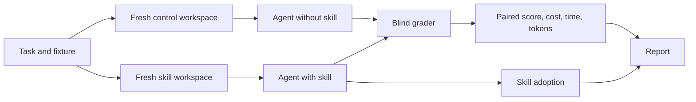

# SkillDiff


Does your Agent Skill help? SkillDiff runs the same task with and without your skill. It grades both runs and reports the difference in score, cost, time, and tokens.

It works with Claude Code, Codex, OpenCode, and Antigravity. It tests one skill or a folder of skills. It also tests a PR.

## Quick start

You need Python 3.10+, Git, and a signed-in agent CLI.

Run these commands to try the demo:

```bash
uv tool install git+https://github.com/karangattu/skilldiff
skilldiff init
skilldiff check
skilldiff run --runs 1
```

> [!IMPORTANT]
> Install from GitHub as shown above. The `skilldiff` package on PyPI is a different project.

## What you get

Each run writes four files:

- `report.html`: full report with tables and takeaways.
- `report.md`: short version for pull requests.
- `report.qmd`: version for Quarto.
- `results.json`: raw data for scripts.

Each run also saves the transcript and the diff for each agent run.

## Example result

The numbers below are examples. They are not real results.

| Metric | Control | Skill | Paired mean Δ | 95% CI | Reading |
|:---|---:|---:|---:|---:|:---|
| Task score (mean) | 60% | 80% | +20 pp | +5 to +35 pp (n=6) | Skill wins |
| Success | 3/5 | 4/5 | +1 | | More successes |
| Cost (median) | $0.30 | $0.24 | -$0.06 | -$0.10 to -$0.02 (n=6) | Costs less |
| Time (median) | 90s | 75s | -15s | -25s to -5s (n=6) | Faster |
| Skill used | unknown | 5/5 | | | Full adoption |

How to read the table:

- Δ is skill minus control as a paired-mean change.
- Control and Skill show means for score and medians for cost and time.
- Reading states the verdict for that row in plain words. It uses the same Δ and interval, so the three columns never disagree.
- If the interval includes zero, the result can be noise.
- `N/A` means the value is unknown, not zero.
- `n=X/Y` shows how many pairs gave a value.
- Cost is the harness-reported price. On subscription auth the real spend is $0 at the margin. The evaluating agent looks up current provider prices and shows the API-equivalent cost from token counts in its final summary.

<details>
<summary>Tips for clear results</summary>

- Use 5 or more runs. One run cannot separate signal from noise.
- Write tasks that need what only the skill gives. Good tasks use obscure APIs, recent changes, or house rules.
- Do not name the skill in prompts. Adoption is part of the test.
- If control scores 100%, the task is too easy. The report calls this a ceiling effect.
- Read warnings about agent errors, grader errors, and skill runs that ignored the skill.

</details>

## Test your own skill

Run this command to create a template for your skill:

```bash
skilldiff init --skill ~/code/my-package/.claude/skills/my-skill --dir my-skill-eval
cd my-skill-eval
```

Then complete these steps:

1. Add a small test project to `fixtures/`.
2. Describe a real task in `tasks/`.
3. Check how the agent did in `graders/`.
4. Run `skilldiff check`.
5. Run `skilldiff run`.

<details>
<summary>What each folder holds</summary>

- `skilldiff.yaml`: name, skill path, harness, models, tasks, and run count.
- `tasks/`: one YAML file per task with an id, a prompt, and a category.
- `fixtures/`: small test projects. SkillDiff copies each fixture to a fresh workspace for each run.
- `graders/`: scripts that grade the work in each workspace.

</details>

## Details

The sections below hold all reference material. Beginners can stop here and run the demo first.

<details>
<summary>Use it from your agent</summary>

SkillDiff ships as an agent skill. Your agent designs tasks, writes graders, runs the test, and explains the report.

Install the skill once:

| Agent | Install | Invoke |
|---|---|---|
| Claude Code | `/plugin marketplace add karangattu/skilldiff`, then `/plugin install skilldiff@skilldiff` | `/skilldiff:skilldiff <path>` |
| Codex | Copy to `~/.agents/skills/skilldiff` | `$skilldiff <path>` |
| OpenCode | Copy to `~/.config/opencode/skills/skilldiff` | Ask for it by name |
| Gemini CLI | Copy to `~/.gemini/skills/skilldiff` | Ask for it by name |

Ask in plain words:

```text
/skilldiff:skilldiff ~/code/py-shiny/.claude/skills/shiny-docs
Test if this skill helps sonnet and opus write current Shiny APIs.
```

The agent then does the work:

1. Reads the skill.
2. Runs `skilldiff init --skill <path>` outside the skill repo.
3. Writes 2 to 5 tasks, fixtures, and graders.
4. Runs `skilldiff check` until the output is clean.
5. Runs a smoke test with `--runs 1`.
6. Asks you before the full run and shows run count and max cost.

</details>

<details>
<summary>Shell, login, network, and time needs</summary>

- Shell access. The agent must run `skilldiff`. In Claude Code allow `Bash(skilldiff *)`.
- Signed-in CLI. SkillDiff starts separate agent runs with your normal login. Sign in once in a terminal with `claude auth login`.
- Network access. If the sandbox blocks new CLIs, runs fail. The report lists them as errors. Then run `skilldiff run` in your own terminal.
- Time. A full test can exceed the agent timeout. Then run it in the background and check it with `skilldiff results`.

</details>

<details>
<summary>How the comparison stays fair</summary>



- Fresh workspaces. Each pair gets two clean copies of the fixture. Only the skill arm has the skill.
- Isolation. For Claude the default blocks user skills and plugins from both arms.
- Random order. Each pair picks the first arm at random.
- Blind grading. Graders see anonymous work with names and arm labels removed.
- Adoption check. The report shows how many skill runs used the skill.
- Paired statistics. Each difference has a bootstrap 95% interval.
- Safe stops. Each agent run has a timeout. Press Ctrl-C to stop and keep a report for done pairs.

</details>

<details>
<summary>Tasks, graders, and categories</summary>

A task file holds an id, a prompt, a category, and a grader:

```yaml
id: fix-parser
category: intended
repo: ../fixtures/parser
prompt: |
  Fix the parser so that it accepts empty input. Keep all tests green.
grader:
  type: command
  command: python3 "$SKILLDIFF_TASK_DIR/../graders/fix_parser.py"
```

Categories:

- `intended`: the skill must help here.
- `irrelevant`: the skill must stay out of the way here.
- `ambiguous`: the trigger is unclear here.
- `general`: default when you set no category.

The report shows adoption and results for each group in By category.

A grader runs in the workspace after the agent stops:

- Exit 0 passes. Other exit codes fail.
- For part scores, print JSON with a `score` from 0 to 1.
- For named checks, print `checks` as a list of `{"name": ..., "passed": ...}`. Bare booleans also work.
- The JSON can be the full output or the last line.
- Keep graders outside the fixture.
- Accept all valid solutions, not only the skill solution.

Example grader output:

```json
{"score": 0.8, "success": false, "checks": [{"name": "parses empty", "passed": true}]}
```

The report adds a By check table. It shows which checks improve and which checks regress.

Ungraded tasks show `N/A`, not `100%`. Grader timeouts and errors show `N/A`, not `0%`.

</details>

<details>
<summary>Thresholds and verdicts</summary>

You can set practical limits in `skilldiff.yaml`:

```yaml
thresholds:
  acceptable_score_regression_pp: 5
  required_cost_reduction_pct: 10
  meaningful_score_gain_pp: 5
```

The verdict then states if the result meets the limits. It separates a useful gain from a small but real gain.

The headline also flags weak proof:

- `only 2 pairs` means the sample is too small.
- `CI collapsed` means all pairs gave the same difference.

</details>

<details>
<summary>Compare skill revisions</summary>

Each run records skill hashes, prompt hashes, fixture hashes, grader hashes, and CLI versions.

Run this command to compare two runs:

```bash
skilldiff compare runs/2026-09-22T120000Z runs/2026-09-23T120000Z
```

The output shows score changes, adoption changes, efficiency changes, and newly failing or passing checks. It warns if models, tasks, or versions differ.

</details>

<details>
<summary>Evaluate a PR</summary>

Run the same tasks with and without a PR:

```bash
git -C ~/code/my-package fetch origin refs/pull/42/head:refs/pull/42/head
skilldiff init --pr 42 --repo ~/code/my-package --base origin/main --dir pr-42-eval
cd pr-42-eval
skilldiff check
skilldiff run --runs 1
```

Control is the merge base. Treatment is the head commit. Reports label the arms Control and Treatment. Use one of `skill` or `pr`, not both. Tasks omit `repo` in PR mode.

</details>

<details>
<summary>Commands</summary>

| Command | What it does |
|---|---|
| `skilldiff init [--skill PATH] [--harness H] [--dir D]` | Make a demo or a template for your skill |
| `skilldiff init --pr N --repo PATH [--base REF] [--dir D]` | Make a PR test from local refs |
| `skilldiff check [-c CONFIG]` | Check the config, the CLI, the skill, and the graders |
| `skilldiff run [-c CONFIG] [--runs N] [-j N] [-m MODEL] [-t TASK]` | Run the test |
| `skilldiff results [RUN_DIR] [--json \| --markdown]` | Show the latest run |
| `skilldiff report [RUN_DIR]` | Rebuild reports for a run |
| `skilldiff compare RUN_A RUN_B [--json]` | Compare two runs |

</details>

<details>
<summary>Harness setup</summary>

Claude Code. The default uses your subscription. SkillDiff removes `ANTHROPIC_API_KEY` from each run. To bill through the API, set `auth: api_key` and export the key.

Codex. The default uses stored login and removes `OPENAI_API_KEY`.

OpenCode. The default `service: go` uses your Go subscription. Sign in with `opencode providers login`.

Antigravity. Short names expand to full models. `gemini-3.8` becomes `gemini-3.8-flash-medium`.

Each harness accepts `bin_path` and `extra_args`. You can also set `CLAUDE_BIN`, `CODEX_BIN`, `OPENCODE_BIN`, or `AGY_BIN`.

</details>

<details>
<summary>Development and changelog</summary>

Run the test suite with these commands:

```bash
git clone https://github.com/karangattu/skilldiff && cd skilldiff
python -m venv .venv && source .venv/bin/activate
pip install -e ".[dev]"
pytest && ruff check skilldiff tests
```

See [CHANGELOG.md](CHANGELOG.md) for version history. Current version is 0.6.0.

</details>
