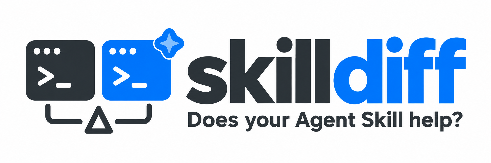
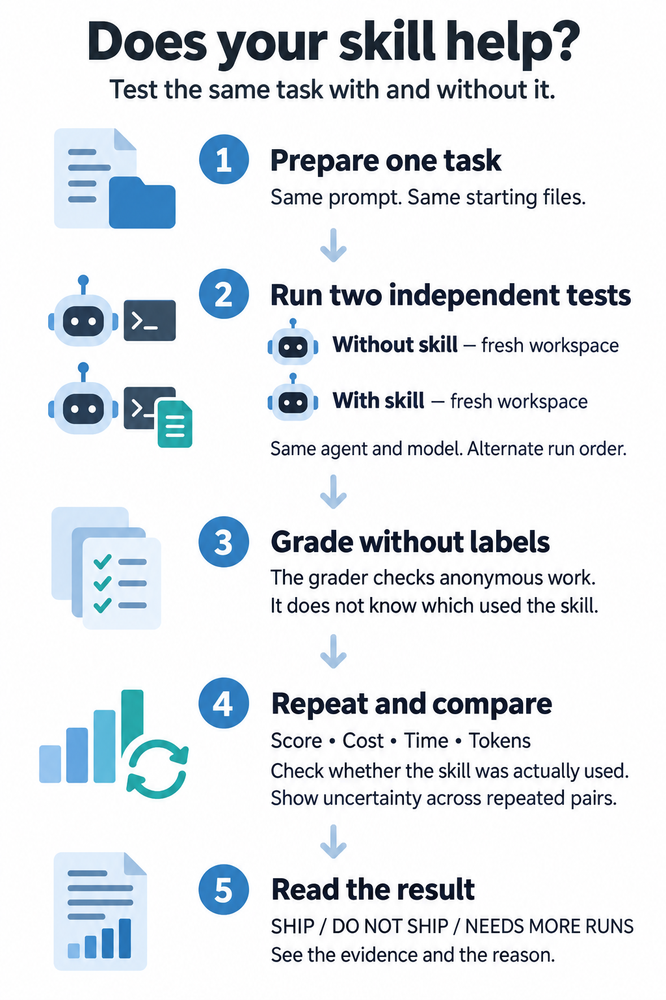

# SkillDiff



Does your Agent Skill help? SkillDiff runs the same task with and without your skill. It grades both runs and reports the difference in score, cost, time, and tokens.

It works with Claude Code, Codex, OpenCode, and Antigravity. It tests one skill or a folder of skills. It also tests a PR.

## Quick start

You need Python 3.10+, Git, and a signed-in agent CLI.

Run these commands to try the demo:

```bash
uv tool install git+https://github.com/karangattu/skilldiff
skilldiff init
skilldiff check
skilldiff run --runs 1
```

> [!IMPORTANT]
> Install from GitHub as shown above. The `skilldiff` package on PyPI is a different project.

## What you get

Each run writes four files:

- `report.html`: full report with tables and takeaways.
- `report.md`: short version for pull requests.
- `report.qmd`: version for Quarto.
- `results.json`: raw data for scripts.

Each run also saves the transcript and the diff for each agent run.

The terminal output and saved reports include an **Evaluation results** table with
App, Arm, Score, Time, Input, Cached input, Output, Total tokens, Tool calls,
Skill loaded, and API-equivalent cost. App is the task ID; each app and arm has a
row per model. Scores are means; resource usage and costs are totals across
repetitions. Cached input includes cache reads and writes. Missing measurements
or pricing show as `N/A`.

Reports end with a **Closing decision** table — score, cost, time, tokens, and
adoption, each with paired change, 95% CI, and a plain reading — followed by one
bottom line: SHIP, DO NOT SHIP, or NEEDS MORE RUNS, with the reason. When the
config records `pricing:` rates (per 1M tokens, with source and date), reports
also reproduce an **API-equivalent cost** table from the saved token breakdown.
A **Skill context tax** table shows the cost of carrying the skill itself: its
installed size, the static tokens it injects on every turn, and the cumulative
overhead across the run.

A complete small evaluation lives in [`examples/csv-totals`](examples/csv-totals):
a skill, dev and held-out tasks, fixtures, a deterministic grader, and a
committed sample report. Copy it as a starting point.

## Example result

The numbers below are examples. They are not real results.

| **App** | **Arm** | **Score** | **Time** | **Input** | **Cached input** | **Output** | **Total tokens** | **Tool calls** | **Skill loaded** | **API-equivalent cost** |
| ------- | ------- | --------- | -------- | --------- | ---------------- | ---------- | ---------------- | -------------- | ---------------- | ----------------------- |
| csv-totals | Control | 60% | 450s | 100,000 | 500,000 | 70,000 | 670,000 | 30 | 0/5 | $1.50 |
| csv-totals | Skill | 80% | 375s | 80,000 | 400,000 | 56,000 | 536,000 | 25 | 5/5 | $1.20 |

How to read the table:

- Δ is skill minus control as a paired-mean change.
- Control and Skill show means for score and medians for cost and time.
- Reading states the verdict for that row in plain words. It uses the same Δ and interval, so the three columns never disagree.
- If the interval includes zero, the result can be noise.
- `N/A` means the value is unknown, not zero.
- `n=X/Y` shows how many pairs gave a value.
- Cost is the harness-reported price. On subscription auth the real spend is $0 at the margin. Record provider rates in `skilldiff.yaml` (`pricing:` with source, date, and per-model rates per 1M tokens) before the run; the report then prices the saved token breakdown itself, and regenerating the report reproduces the estimate.

<details>
<summary>Tips for clear results</summary>

- Use 5 or more runs as a starting point, not a rule. Fix the budget before you look at results.
- Cover four kinds: intended tasks, normal representative tasks, irrelevant tasks, and ambiguous plus regression tasks.
- Split `tasks/dev/` (iterate) from `tasks/heldout/` (freeze before the full run). The report keeps them separate in By split and decides on held-out only.
- Write tasks that need what only the skill gives. Good tasks use obscure APIs, recent changes, or house rules.
- Do not name the skill in prompts. Adoption is part of the test.
- If control scores 100%, the task is too easy. The report calls this a ceiling effect.
- Read warnings about agent errors, grader errors, and skill runs that ignored the skill.
- Many repetitions of two tasks still describe only those two tasks. Add tasks before you generalize.

</details>

## Test your own skill

Run this command to create a template for your skill:

```bash
skilldiff init --skill ~/code/my-package/.claude/skills/my-skill --dir my-skill-eval
cd my-skill-eval
```

Then complete these steps:

1. Add a small test project to `fixtures/`.
2. Describe a real task in `tasks/`.
3. Check how the agent did in `graders/`.
4. Run `skilldiff check`.
5. Run `skilldiff run`.

**What each folder holds:** `skilldiff.yaml` holds name, skill path, harness, models, tasks, run count, seed, thresholds, failure policy, and optional `pricing:` rates (source, date, per-1M-token prices) for reproducible API-equivalent costs. `tasks/` holds one YAML file per task with an id, a prompt (or `prompts:` for a multi-turn script), a category, an optional `split: dev|held-out`, optional path assertions (`allowed_paths`, `forbidden_paths`), and optional `validation: {good, broken}`. `fixtures/` holds the small test projects, copied fresh for each run without `.git` history and with escaping symlinks rejected. `graders/` holds the scripts that score the work.

Every key listed there is checked when the config loads: an unknown or misspelled key (in the experiment file, a nested block such as `claude:` or `thresholds:`, a task file, or a `grader:`) fails `skilldiff check` and `skilldiff run` immediately, naming the closest matching key, instead of being ignored while the run uses defaults you never chose.

Older block names (`agy:` and `on_failure:`) are checked even when their replacements are also present. Optional sections accept `null` or `{}`; lists, booleans, numbers, and strings are rejected instead of being treated as empty settings.

## Details

The sections below hold all reference material. Beginners can stop here and run the demo first.

<details>
<summary id="why-skilldiff">Why SkillDiff, and how it stays fair</summary>

You can compare a skill by hand: ask an agent to do a task once with the skill
and once without, then read both results. That is fine for a quick sanity check.
It falls apart as a measurement, because the parts that make the comparison
trustworthy are bookkeeping that is easy to skip and hard to notice you skipped.

| By hand | SkillDiff |
|---|---|
| Runs both arms in your working repo | A fresh copy of the fixture per arm, with no `.git` history; escaping symlinks are rejected |
| Lets the agent see which run is which, and sometimes grade its own work | Graders see `candidate-A` and `candidate-B`, with names and arm labels removed |
| Runs one arm, then the other | Seeded, balanced order, so neither arm keeps the warm cache every time |
| Compares two numbers by eye | Paired differences with a bootstrap 95% confidence interval |
| Edits the skill while testing | Each run freezes skills, tasks, fixtures, and graders under a sha256 manifest |
| Judges whether the output looked good | Also records adoption, cost, time, and tokens for both arms |

<p align="center">
  
</p>

What keeps it fair:

- **Isolation.** If the control arm can reach the skill, there is no clean baseline. SkillDiff checks for this and marks the run INVALID rather than printing a number you would misread. For Claude the default blocks user skills and plugins from both arms.
- **Blind grading.** Graders see anonymous work, with names and arm labels removed.
- **Balanced order.** Each task and model alternates which arm runs first, from a recorded seed, so no arm keeps the warm cache every time.
- **Adoption.** The usual way a skill "fails" is that it never loaded. The report counts how many skill runs actually used the skill.
- **Uncertainty.** Each difference has a bootstrap 95% interval, and the report flags a ceiling effect when control already scores 100%.
- **Frozen inputs.** Each run keeps copies of its skills, tasks, fixtures, and graders under a versioned sha256 manifest, so editing the originals cannot change later pairs. Keep the evaluation output outside the skill and fixture directories.
- **Safe stops and resume.** Every agent run has a timeout. Press Ctrl-C to stop and keep a report for the pairs that finished; resume refuses to mix in changed inputs.

| Do it by hand when… | Reach for SkillDiff when… |
|---|---|
| You want a quick sanity check. | The result will decide whether the skill ships. |
| A single anecdote is enough. | Someone will ask you to defend the number. |
| You want a feel for whether the skill does anything at all. | |

</details>

<details>
<summary>Use it from your agent</summary>

SkillDiff ships as an agent skill. Your agent designs tasks, writes graders, runs the test, and explains the report.

There are two separate installs. Only the first one is yours:

- **The skilldiff skill** goes into your own agent once, so the agent can drive skilldiff. Use the command below.
- **The skill under test** is copied into each fresh workspace by skilldiff itself, once per run. You never do this by hand. See [Where skilldiff installs the skill under test](#where-skilldiff-installs-the-skill-under-test).

Install the skilldiff skill once. One command covers every supported agent (needs Node):

```bash
npx skills add karangattu/skilldiff -g -y -a claude-code
```

This is the [`skills` CLI](https://github.com/vercel-labs/skills). `-g` installs at user level so the skill is available in every project; without it the skill lands in the current folder, which is usually not what you want. `-a` names the agent to install into, so set it to the one you actually use. Run `npx skills update` later to refresh.

Always pass `-a`. With no `-a` the CLI auto-detects your agents, and when it detects none it installs the skill into every agent it knows about, about sixty directories at once. Passing `-a` keeps the install to a single location.

| Agent | `--agent` | Installs to |
|---|---|---|
| Claude Code | `claude-code` | `~/.claude/skills/skilldiff` |
| Codex | `codex` | `~/.agents/skills/skilldiff` |
| OpenCode | `opencode` | `~/.agents/skills/skilldiff` |
| Antigravity | `antigravity` | `~/.agents/skills/skilldiff` |

The `--agent` names are not quite skilldiff's `--harness` names. SkillDiff's `--harness` flag takes `claude`, `codex`, `opencode`, and `antigravity`; note the Gemini CLI is `antigravity` there, because that is the harness name skilldiff accepts.

These user-level paths are exactly the ones `skilldiff check` watches, so an existing install shows up as contamination in `check` output instead of silently skewing a run.

If you cannot use `npx`, install the skill by hand instead: copy the `skills/skilldiff` folder into your agent's user-level skills directory (same locations as the workspace ones in [Where skilldiff installs the skill under test](#where-skilldiff-installs-the-skill-under-test), but under your home directory). Claude Code users can also install the plugin, which adds the `/skilldiff:skilldiff <path>` slash command:

```bash
# Inside Claude Code
/plugin marketplace add karangattu/skilldiff
/plugin install skilldiff@skilldiff
```

Ask in plain words:

```text
/skilldiff:skilldiff ~/code/py-shiny/.claude/skills/shiny-docs
Test if this skill helps sonnet and opus write current Shiny APIs.
```

Only Claude Code gets the `/skilldiff:skilldiff` command. On Codex, OpenCode, and Antigravity, describe the same work in plain words and the agent picks up the skill.

The agent then does the work:

1. Reads the skill.
2. Runs `skilldiff init --skill <path>` outside the skill repo.
3. Writes 2 to 5 tasks, fixtures, and graders.
4. Runs `skilldiff check` until the output is clean.
5. Runs a smoke test with `--runs 1`.
6. Asks you before the full run and shows run count and max cost.

</details>

<details>
<summary id="where-skilldiff-installs-the-skill-under-test">Where skilldiff installs the skill under test</summary>

Before each treatment run, skilldiff copies the skill under test into the fresh workspace. You never do this yourself. Some harnesses read more than one location, so skilldiff writes all of them:

| Harness (`--harness`) | Workspace location for the skill under test |
|---|---|
| `claude` | `.claude/skills/<name>` |
| `codex` | `.codex/skills/<name>`, `.agents/skills/<name>` |
| `opencode` | `.opencode/skills/<name>`, `.agents/skills/<name>` |
| `antigravity` | `.agents/skills/<name>` |

The control arm gets none of these. In A/B mode both arms carry a skill and the other revision is stripped from the fixture. See [Why SkillDiff, and how it stays fair](#why-skilldiff).

SkillDiff also scans these user-level paths for contamination, and `check` reports anything it finds there as a contamination warning:

| Harness | User-level paths watched |
|---|---|
| `claude` | `~/.claude/skills`, `~/.claude/plugins`, `~/.claude/CLAUDE.md`, `~/.claude/memory`, `~/.claude/settings.json` |
| `codex` | `~/.codex/skills`, `~/.agents/skills`, `~/.codex/AGENTS.md`, `~/.codex/memory` |
| `opencode` | `~/.config/opencode/skills`, `~/.config/opencode/plugins`, `~/.claude/skills`, `~/.agents/skills`, `~/.config/opencode/AGENTS.md`, `~/.config/opencode/memory` |
| `antigravity` | `~/.gemini/skills`, `~/.agents/skills`, `~/.gemini/GEMINI.md`, `~/.gemini/memory` |

Antigravity's own docs have moved its global location between releases (`~/.gemini/config/skills/` now, `~/.gemini/antigravity/skills/` and `~/.gemini/skills/` earlier), and the `skills` CLI writes `~/.agents/skills`, which every current Antigravity surface reads. SkillDiff watches `~/.gemini/skills` and `~/.agents/skills`, and `isolate: true` keeps user-level skills out of both arms regardless.

</details>

<details>
<summary id="tasks-graders-and-categories">Tasks, graders, and categories</summary>

A task file holds an id, a prompt, a category, a split, and a grader:

```yaml
id: fix-parser
category: intended
split: held-out        # dev (iterate) or held-out (frozen validation)
repo: ../fixtures/parser
prompt: |
  Fix the parser so that it accepts empty input. Keep all tests green.
allowed_paths: [parser.py, "tests/**"]   # edits outside these are reported as errors
forbidden_paths: ["**/*.lock"]
grader:
  type: command
  command: python3 "$SKILLDIFF_TASK_DIR/../graders/fix_parser.py"
```

A task can also be scripted across several turns. Set `prompts:` to a list and
each prompt runs in order in the same workspace, with tokens, cost, time, and
turns summed across the turns.

`allowed_paths` and `forbidden_paths` are integrity assertions. When a run
modifies an out-of-scope file it is reported as an error, `N/A` with the path
named, never as `0%`, so a stray edit cannot look like a wrong answer.

Categories:

- `intended`: the skill must help here.
- `irrelevant`: the skill must stay out of the way here.
- `ambiguous`: the trigger is unclear here.
- `general`: default when you set no category.

The report shows adoption and results for each group in By category.

Splits separate development from validation. `split` is `dev` or `held-out`
(it is inferred from `tasks/dev/` and `tasks/heldout/` directories and may be
omitted; a contradiction refuses). The report shows a By split table, and when
held-out pairs exist the headline and closing decision use them only, so
development results cannot stand in for validation.

A grader runs in the workspace after the agent stops:

- Exit 0 with no JSON passes. Exit non-zero with no JSON fails, unless the output shows a crash.
- For part scores, print JSON with a `score` from 0 to 1.
- For named checks, print `checks` as a list of `{"name": ..., "passed": ...}`. Bare booleans also work.
- The JSON can be the full output or the last line. Bad shapes report `error`, not a score.
- A crashing grader (traceback, missing file, bad exit) shows `N/A`, not `0%`. Test failure shows `0%`.
- Keep graders outside the fixture. Outside is not isolation by itself: confine agents so they cannot read parent paths.
- Accept all valid solutions, not only the skill solution.
- For output a script cannot score, set `type: llm` (alias `rubric`) with a `rubric:` describing what counts as correct. A judge model scores the response and diff, and must return JSON with `score`, `success`, and `feedback`. Add `command:` to run your own judge instead of the built-in one.

Example grader output:

```json
{"score": 0.8, "success": false, "checks": [{"name": "parses empty", "passed": true}]}
```

The report adds a By check table. It shows which checks improve and which checks regress.

Ungraded tasks show `N/A`, not `100%`. Grader timeouts and errors show `N/A`, not `0%`.

Validate the grader three ways in the task file:

```yaml
validation:
  good: ../validation/fix-parser-good
  broken: [../validation/fix-parser-bad]
```

`check` then grades untouched (must be below 100%), known-good (must be 100%), and broken (must fail).

</details>

<details>
<summary>Thresholds and verdicts</summary>

You can set practical limits in `skilldiff.yaml`:

```yaml
thresholds:
  acceptable_score_regression_pp: 5
  required_cost_reduction_pct: 10
  required_token_reduction_pct: 20  # session-token saving (compression)
  meaningful_score_gain_pp: 5
failure_policy:
  agent_failure: exclude  # or "zero" (failed sessions score 0)
  missing: exclude
```

Shipping needs bounds to clear the limits, not point estimates. The verdict checks the lower confidence bound for score and requires the cost and token intervals to exclude increases. It separates a useful gain from a small but real gain. For compression, equal scores still evaluate thresholds: quality preserved plus proven resource savings is the win.

The report ends with one bottom line applying these rules: **SHIP**, **DO NOT
SHIP**, or **NEEDS MORE RUNS**, with the reason. A confidence interval that
includes zero is never SHIP, and an established regression is never SHIP.

The headline also flags weak proof:

- `only 2 pairs` means the sample is too small.
- `CI collapsed` means all pairs gave the same difference.
- `only 2 tasks` means repetitions describe those tasks, not the skill in general.

Define `failure_policy` before you run. With `agent_failure: exclude`, an agent
error or timeout is omitted from paired scores, success counts, time, token, and
cost comparisons even if the grader scored its partial work. The failed attempt
and its raw measurements remain visible in Run details. With `zero`, a failed
agent gets a task score of zero and its resource use remains in the comparison;
its partial grader checks are still diagnostic only. Grader timeouts and errors
are always `N/A`.

</details>

<details>
<summary id="presets-revisions-and-pr-tests">Presets, revisions, and PR tests</summary>

Four named presets configure the same runner with clear arms and decision rules:

| Preset | Control | Treatment | Decides |
|---|---|---|---|
| `skill` | Agent without the skill | Same agent with the skill | Does the skill help? |
| `pr` | Code without PR changes | Code with PR changes | Does the PR change behaviour? |
| `revision` | Skill A | Skill B | Which revision wins? |
| `compression` | Original skill | Minified skill | Is quality preserved with fewer resources? |

```bash
# 1. No skill versus skill
skilldiff init --skill /path/to/my-skill --dir evaluations/skill-effectiveness

# 2. Skill A versus skill B (add --include-baseline for a no-skill arm per pair)
skilldiff init --skill-a /path/to/v1/my-skill \
  --skill-b /path/to/v2/my-skill --dir evaluations/skill-revisions

# 3. Original versus an already-created minified skill
skilldiff init --skill-a /path/to/original/my-skill \
  --skill-b /path/to/minified/my-skill --preset compression \
  --dir evaluations/skill-compression

# 4. PR; fetch the ref first
git -C /path/to/repo fetch origin refs/pull/42/head:refs/pull/42/head
skilldiff init --pr 42 --repo /path/to/repo --base origin/main --dir evaluations/pr-42
# --pr-mode agent (agents work on each revision) or correctness (graders run on untouched revisions)
# --pr-pair merge-base (merge-base vs head) or base-merge (base tip vs synthetic merge)
cd evaluations/pr-42
skilldiff check
skilldiff run --runs 1
```

Each template still needs representative tasks, fixtures, and graders. Tune on dev tasks, then compare frozen versions on held-out tasks.

For revision and compression, control is skill A and treatment is skill B on identical fixtures with paired results. The baseline arm rotates through all three positions, and the report shows baseline-vs-A and baseline-vs-B alongside A-vs-B, plus source-size reduction for compression. Compression keeps the skill name and trigger description identical so adoption changes do not confound the body comparison, records source-size reduction separately from session tokens, cost, and time, and requires bounds to support the decision (for example: at most 2pp loss with at least 20% fewer tokens).

Reports label the arms per preset (Original/Minified, Skill A/Skill B, Without/With PR). Use one of `skill`, `skill_a` plus `skill_b`, or `pr`, not more than one, with `preset` set to `skill`, `revision`, `compression`, or `pr`. Tasks omit `repo` in PR mode, and correctness mode runs no agents.

Each run records skill hashes, prompt hashes, fixture hashes, grader hashes, locks, and CLI versions; the task hash includes grader contents and locks, and all files are hashed with no silent caps. To compare two old runs:

```bash
skilldiff compare runs/2026-09-22T120000Z runs/2026-09-23T120000Z
# add --strict to reject mismatched models, tasks, or hashes
```

The output shows score changes, adoption changes, efficiency changes, and newly failing or passing checks. Efficiency uses per-run means over matched tasks and repetitions, not totals. It warns if models, tasks, or versions differ. Prefer a single-run A/B over `compare`, which must match tasks and repetitions to normalize efficiency.

</details>

<details>
<summary>Resume compatibility and recovery</summary>

`skilldiff run --resume` selects the latest run. `--resume-from DIR` selects a specific run. Resume validates the saved metadata, input snapshots, checkpoint, and all completed arm artifacts before writing to that run.

- Keep skills, tasks, fixtures, PR revisions, models, preset, baseline settings, active harness configuration, timeout, parallelism, failure policy, thresholds, and tool versions unchanged.
- Omit `--seed` to reuse the original seed, or supply that same seed. You may increase `--runs`; decreasing it is refused.
- Missing or corrupt records, changed snapshots, and incomplete pairs stop recovery with an error. Existing artifacts remain available. SkillDiff never silently reruns a partial paid pair; start a new run if needed.
- Runs created before frozen-input metadata was introduced remain readable by `results`, `report`, and `compare`, but require a new run instead of resume.
- Graders stay at their original paths. SkillDiff checks the grader directories and dependency locks tracked by provenance before and after grading. A change stops the run without completing that pair. Python import and pytest caches are excluded. Arbitrary external scripts, installed dependencies, and network services used by grader commands are not frozen or fully tracked.
- Original inputs must still match the saved snapshots when resuming. Restore any edits or start a new experiment. Changes to originals during an already running experiment do not affect its frozen workspaces.

Keep the entire run directory, including `inputs/`, for recovery. A small sibling `.lock` file is normal; its OS lock releases when the process exits, including after a crash. Do not delete the lock file while a writer is active.

</details>

<details>
<summary id="harness-setup-and-commands">Harness setup and commands</summary>

| Command | What it does |
|---|---|
| `skilldiff init [--skill PATH] [--harness H] [--dir D]` | Make a demo or a template for your skill |
| `skilldiff init --skill-a A --skill-b B [--include-baseline] [--preset revision\|compression] [--dir D]` | Make a skill A/B test with paired results |
| `skilldiff init --pr N --repo PATH [--base REF] [--pr-mode M] [--pr-pair P]` | Make a PR test from local refs |
| `skilldiff check [-c CONFIG]` | Check the config, the CLI, the skill, isolation, and the graders |
| `skilldiff run [-c CONFIG] [--runs N] [-j N] [-m MODEL] [-t TASK] [--resume \| --resume-from DIR] [--seed N]` | Run the test (resume reuses pairs only when hashes match) |
| `skilldiff results [RUN_DIR] [--json \| --markdown]` | Show the latest run |
| `skilldiff report [RUN_DIR]` | Rebuild reports for a run |
| `skilldiff compare RUN_A RUN_B [--json] [--strict]` | Compare two runs |
| `skilldiff lint [SKILL_DIR] [--json]` | Lint SKILL.md frontmatter, trigger keywords, and length |
| `skilldiff diagnose [RUN_DIR] [--json]` | Diagnose failure modes, regressions, and adoption gaps |

`lint` checks a `SKILL.md` before you spend anything: required frontmatter, naming rules, description length and broad phrasing, unclosed code fences, and broken relative links, with an estimated token count. `diagnose` reads a finished run and names what went wrong: a skill that never triggered on intended tasks, one that triggered on irrelevant tasks, regressions, blast-radius violations, agent failures, and token bloat without score gains, each with a suggested fix.

Claude Code. The default uses your subscription. SkillDiff removes `ANTHROPIC_API_KEY` from each run. To bill through the API, set `auth: api_key` and export the key. Sandboxing is `permission_mode` plus `allowed_tools`, and `isolate: true` keeps user-level skills, plugins, and `CLAUDE.md` out of both arms.

Codex. The default uses stored login and removes `OPENAI_API_KEY`. Sandboxing is `sandbox: workspace-write` (or `dangerously_bypass_approvals_and_sandbox`).

OpenCode. The default `service: go` uses your Go subscription. Sign in with `opencode providers login`. Permissions are `dangerously_skip_permissions`.

Antigravity. Short names expand to full models. `gemini-3.8` becomes `gemini-3.8-flash-medium`. Permissions are `dangerously_skip_permissions`.

Sign in with each CLI's normal login before you run. Each harness accepts `bin_path` and `extra_args`. You can also set `CLAUDE_BIN`, `CODEX_BIN`, `OPENCODE_BIN`, or `AGY_BIN`.

By default runs are on the host. Set `isolation: docker` (or `podman`) in `skilldiff.yaml`, with an optional `container_image` (default `python:3.11`), to run the agent and graders inside a container with the workspace mounted. The runtime must be on `PATH`.

Running these from inside an agent needs a few things too:

- Shell access. The agent must run `skilldiff`. In Claude Code allow `Bash(skilldiff *)`.
- A signed-in CLI. SkillDiff starts separate agent runs with your normal login. Sign in once in a terminal with `claude auth login`.
- Network access. If the sandbox blocks new CLIs, runs fail. The report lists them as errors. Then run `skilldiff run` in your own terminal.
- Time. A full test can exceed the agent timeout. Then run it in the background and check it with `skilldiff results`.

</details>

## Development

```bash
git clone https://github.com/karangattu/skilldiff && cd skilldiff
python -m venv .venv && source .venv/bin/activate
pip install -e ".[dev]"
pytest && ruff check skilldiff tests
```

See [CHANGELOG.md](CHANGELOG.md) for version history. Current version is 0.10.1.
