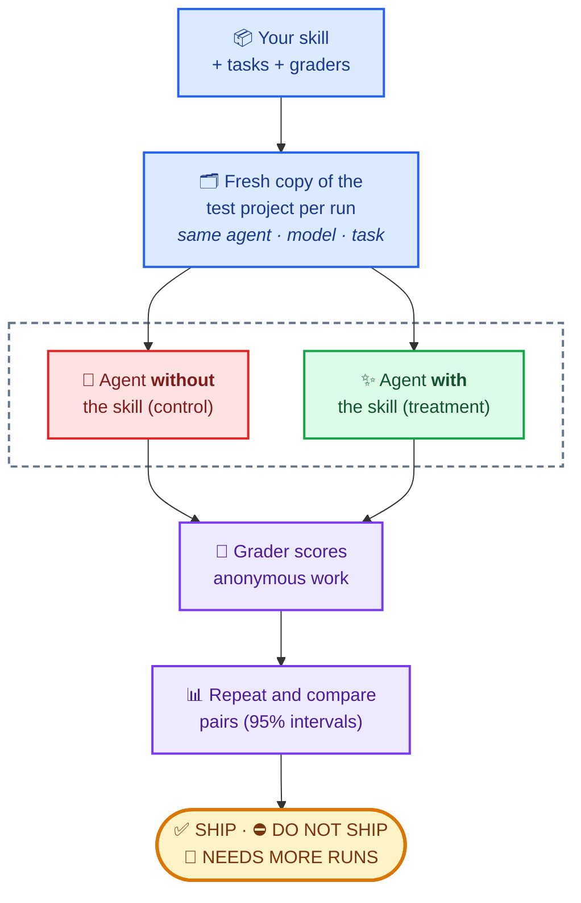

# SkillDiff


Does your Agent Skill actually help? SkillDiff gives an agent the same tasks with and
without your skill. It grades both and reports the difference in score, cost, time,
and tokens. It ends with one bottom line: **SHIP**, **DO NOT SHIP**, or
**NEEDS MORE RUNS**.

It works with Claude Code, Codex, OpenCode, and Antigravity. It can test one skill,
a folder of skills, two versions of a skill, or a pull request.

## How it works


```mermaid
flowchart TB
    T["📦 Your skill<br/>+ tasks + graders"] --> W["🗂️ Fresh copy of the<br/>test project per run<br/><i>same agent · model · task</i>"]
    subgraph PAIR [" "]
        direction LR
        C["🚫 Agent <b>without</b><br/>the skill (control)"]
        S["✨ Agent <b>with</b><br/>the skill (treatment)"]
    end
    W --> C
    W --> S
    C --> G["🙈 Grader scores<br/>anonymous work"]
    S --> G
    G --> R["📊 Repeat and compare<br/>pairs (95% intervals)"]
    R --> V(["✅ SHIP · ⛔ DO NOT SHIP<br/>🔁 NEEDS MORE RUNS"])

    classDef input fill:#dbeafe,stroke:#2563eb,stroke-width:2px,color:#1e3a8a
    classDef control fill:#fee2e2,stroke:#dc2626,stroke-width:2px,color:#7f1d1d
    classDef treatment fill:#dcfce7,stroke:#16a34a,stroke-width:2px,color:#14532d
    classDef grade fill:#ede9fe,stroke:#7c3aed,stroke-width:2px,color:#4c1d95
    classDef verdict fill:#fef3c7,stroke:#d97706,stroke-width:3px,color:#78350f
    class T,W input
    class C control
    class S treatment
    class G,R grade
    class V verdict
    style PAIR fill:transparent,stroke:#64748b,stroke-width:2px,stroke-dasharray:6 4
```

- Both arms use the same agent, model, task, and starting files. Only the skill differs.
- Each run gets its own throwaway workspace. The control arm never sees the skill.
- Graders see `candidate-A` and `candidate-B`, never which arm is which.
- Arm order alternates from a recorded seed. Inputs are frozen and hashed, so results are reproducible.

## Install

You need Python 3.10+, Git, and a signed-in agent CLI (`claude`, `codex`, `opencode`, or `agy`).

**1. Install the `skilldiff` tool:**

```bash
uv tool install git+https://github.com/karangattu/skilldiff
```

> [!NOTE]
> A git install is pinned to the commit resolved at install time, so an existing
> `skilldiff` will not pick up later fixes on its own. Run `uv tool upgrade skilldiff`
> to refresh it.

> [!IMPORTANT]
> Install from GitHub as shown above. The `skilldiff` package on PyPI is a different project.

**2. Install the skill into your agent** (replace `claude-code` with `codex`, `opencode`, or `antigravity`):

```bash
npx skills add karangattu/skilldiff -g -y -a claude-code
```

To upgrade installed skills to the latest version:

```bash
npx skills update skilldiff -g
```

| Agent | `-a` value | Installs to |
|---|---|---|
| Claude Code | `claude-code` | `~/.claude/skills/skilldiff` |
| Codex | `codex` | `~/.agents/skills/skilldiff` |
| OpenCode | `opencode` | `~/.agents/skills/skilldiff` |
| Antigravity | `antigravity` | `~/.agents/skills/skilldiff` |

Always pass `-a`. Without it, the [`skills` CLI](https://github.com/vercel-labs/skills)
may install into every agent it knows, which is about sixty folders. `-g` installs
for your user, so every project can use the skill. Without `npx`, copy the
[`skills/skilldiff`](skills/skilldiff) folder into the folder shown in the table.
Claude Code users can instead install the plugin, which adds a
`/skilldiff:skilldiff <path>` command:

```bash
# Inside Claude Code
/plugin marketplace add karangattu/skilldiff
/plugin install skilldiff@skilldiff
```

You install only the skilldiff skill. SkillDiff copies the skill *under test* into
each run's workspace itself.

## Ask your agent

Once the skill is installed, ask in plain words. Paste a request like this:

```text
Use skilldiff to test whether the skill at ~/code/my-pkg/skills/my-skill helps.
Use the claude harness with sonnet. Set up the experiment outside the skill's
repo, run skilldiff check and a 1-run smoke test, then show me the full-run
cost and wait for my OK before running it.
```

Change `claude` to `codex`, `opencode`, or `antigravity`, and pick a model you use.
These requests also work:

```text
Use skilldiff to compare ~/skills/v1/my-skill against ~/skills/v2/my-skill on codex.
Use skilldiff to check whether PR 42 in ~/code/my-pkg changes agent results.
Read the latest skilldiff run and tell me whether to ship the skill.
```

The agent then:

1. Reads and lints the skill (`skilldiff lint`).
2. Creates the experiment (`skilldiff init`) and writes tasks, test projects, and graders.
3. Runs `skilldiff check` and fixes what it reports.
4. Runs a smoke test (`skilldiff run --runs 1`) and reads some transcripts.
5. Shows you the session count and maximum cost, and waits for your OK.
6. Runs the full test, then explains the report and `skilldiff diagnose` output.

**One-time setup if your agent sandboxes its shell.** Your agent runs `skilldiff`,
and `skilldiff` starts its own agent sessions. Those sessions need network access
and write access to their login folder. Allow `skilldiff` once:

| Your agent | One-time setup |
|---|---|
| Claude Code | In `.claude/settings.json`: `{"permissions": {"allow": ["Bash(skilldiff *)"]}, "sandbox": {"excludedCommands": ["skilldiff *"]}}` |
| Codex | Add `prefix_rule(pattern=["skilldiff"], decision="allow")` to `~/.codex/rules/default.rules`, or approve the command when Codex asks |
| OpenCode | Nothing by default. If you restricted bash, add `{"permission": {"bash": {"skilldiff *": "allow"}}}` to `opencode.json` |
| Antigravity | Approve `skilldiff` when asked, or add `command(skilldiff)` and `unsandboxed(skilldiff)` to `permissions.allow` in `~/.gemini/antigravity-cli/settings.json` |

If you skip this setup, `skilldiff check` fails with a `host:` line and prints the
fix for your agent. `skilldiff run` refuses to start rather than fail every session.
A full run can outlast your agent's shell timeout, so the skill tells your agent to
run it in the background.

## Or run it yourself

```bash
skilldiff init --skill ~/code/my-pkg/skills/my-skill --harness claude --dir my-skill-eval
cd my-skill-eval
# 1. Put a small test project in fixtures/
# 2. Describe a real task in tasks/ (do not name the skill in the prompt)
# 3. Write a grader in graders/ that scores the result
skilldiff check          # validates config, CLI login, permissions, and graders
skilldiff run --runs 1   # smoke test: one pair per task
skilldiff run            # full run
skilldiff results        # show the latest run
```

[`examples/csv-totals`](examples/csv-totals) is a complete small experiment you can
copy. It has a skill, dev and held-out tasks, fixtures, a grader, and a sample report.

| Command | What it does |
|---|---|
| `skilldiff init` | Create an experiment (`--skill`, `--skill-a/--skill-b`, or `--pr`) |
| `skilldiff check` | Check config, CLI login, permissions, skill exposure, and graders |
| `skilldiff run` | Run the experiment (`--runs N`, `-t TASK`, `--resume`) |
| `skilldiff results` / `report` | Show or rebuild the reports for a run |
| `skilldiff diagnose` | Explain failures: skill not triggering, regressions, denied tools |
| `skilldiff regrade` | Re-grade a finished run after a grader fix, without new sessions |
| `skilldiff compare` | Compare two runs |
| `skilldiff lint` | Lint a `SKILL.md` before you spend anything |

## Reading the result

Each run writes `report.html`, `report.md` (for pull requests), `report.qmd`, and
`results.json`, plus each session's transcript and diff. The core table looks like
this (the numbers are examples):

| **App** | **Arm** | **Score** | **Time** | **Input** | **Cached input** | **Output** | **Total tokens** | **Tool calls** | **Turns** | **Skill loaded** | **API-equivalent cost** |
| ------- | ------- | --------- | -------- | --------- | ---------------- | ---------- | ---------------- | -------------- | --------- | ---------------- | ----------------------- |
| csv-totals | Control | 60% | 450s | 100,000 | 500,000 | 70,000 | 670,000 | 30 | 15 | 0/5 | $1.50 |
| csv-totals | Skill | 80% | 375s | 80,000 | 400,000 | 56,000 | 536,000 | 25 | 10 | 5/5 | $1.20 |
| csv-totals | Δ (Skill - Control) | +20 pp | -75s | -20,000 | -100,000 | -14,000 | -134,000 | -5 | -5 | | -$0.30 |

- **Δ** is the paired change, skill minus control. If its 95% interval includes zero, the difference may be noise.
- **Skill loaded** counts runs where the agent actually used the skill. Low adoption usually means the skill's `description` does not match how people ask.
- **`N/A`** means unknown, never zero. Failed sessions and grader errors are reported apart from low scores.
- The report ends with a **Closing decision** table and one bottom line, with the reason.

## Permissions in agent sessions

The agent sessions skilldiff starts run headless, so nobody can answer a permission
prompt. A tool that asks is refused, and the agent quietly works without it. The
defaults avoid prompts and give both arms the same permissions:

| Harness | Default | To allow network |
|---|---|---|
| `claude` | `sandbox: true`: Bash runs in Claude's own sandbox without prompts; writes stay in the workspace | `allowed_domains: ["pypi.org"]` |
| `codex` | `sandbox: workspace-write`, no prompts | `network_access: true` |
| `opencode` | `dangerously_skip_permissions: true` (passes `--auto`) | already allowed |
| `antigravity` | `dangerously_skip_permissions: true` | already allowed |

`skilldiff check` prints what sessions may do. Reports and `skilldiff diagnose` count
denied tool calls per arm for all four harnesses (including Codex sandbox blocks), so
a broken permission setup cannot pass as a low score. To block reads outside the workspace as well, use
`isolation: docker`/`podman`, or `isolation: macos` for Claude and Codex.

## Tips for useful results

- Write tasks that need what only the skill knows, such as obscure APIs, recent changes, or house rules. If control already scores 100%, the task is too easy.
- Include tasks where the skill should stay out of the way (`category: irrelevant`).
- Tune on `tasks/dev/`, then freeze `tasks/heldout/`. The decision uses held-out pairs only.
- Start with 5 or more runs per arm, and fix that number before you look at results.
- Give each grader a known-good and a broken solution (`validation:`), so `check` can prove the grader works.

## More detail

The [reference](docs/reference.md) has the exact rules:

- [Reports and outputs](docs/reference.md#reports-and-outputs) and [the example result](docs/reference.md#example-result)
- [Experiment files](docs/reference.md#experiment-files) and [tasks, graders, and categories](docs/reference.md#tasks-graders-and-categories)
- [Why SkillDiff, and how it stays fair](docs/reference.md#why-skilldiff)
- [Where skilldiff installs the skill under test](docs/reference.md#where-skilldiff-installs-the-skill-under-test)
- [Thresholds and verdicts](docs/reference.md#thresholds-and-verdicts)
- [Presets, revisions, and PR tests](docs/reference.md#presets-revisions-and-pr-tests)
- [Resume compatibility and recovery](docs/reference.md#resume-compatibility-and-recovery)
- [Harness setup and commands](docs/reference.md#harness-setup-and-commands)
- [Preflight safeguards](skills/skilldiff/references/preflight.md) and [reporting rules](skills/skilldiff/references/reporting.md)

## Development

```bash
git clone https://github.com/karangattu/skilldiff && cd skilldiff
python -m venv .venv && source .venv/bin/activate
pip install -e ".[dev]"
pytest && ruff check skilldiff tests
```

See [CHANGELOG.md](CHANGELOG.md) for version history. Current version is 0.17.0.
